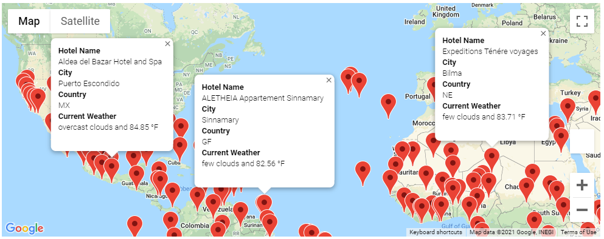
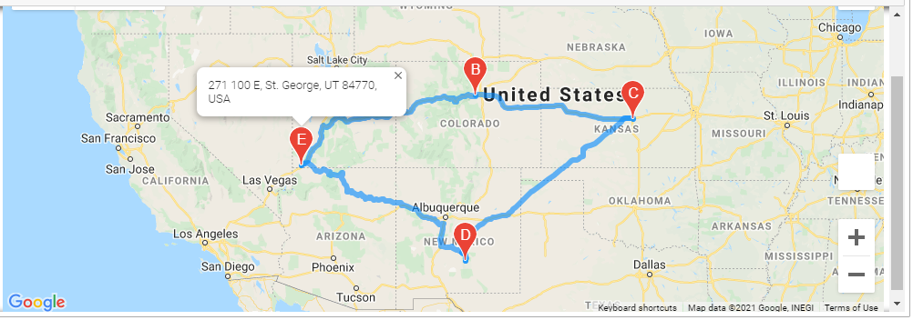
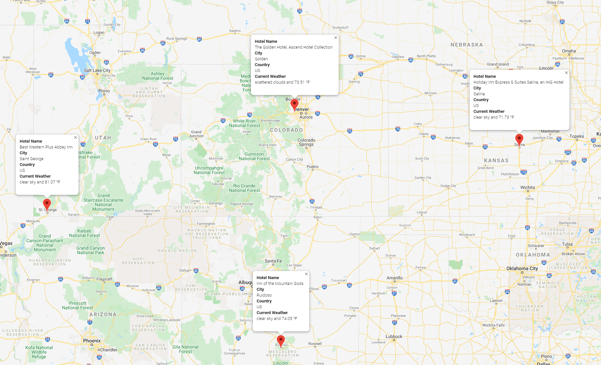

# WeatherPy with Python API

## Overview of the analysis

 Management has requested adding the following features to PlanMyTrip app:

- adding the weather description to the weather data
- use input statements to filter the data for their weather preferences
- identify potential travel destinations and nearby hotels
- create a travel itinerary
- using the Google Maps Directions API, create a travel route between the four cities as well as a marker layer map

## Results

- WeatherPy Vacation Map
 
 

- WeatherPy Travel Map
 
 

- WeatherPy Vacation Map Markers

